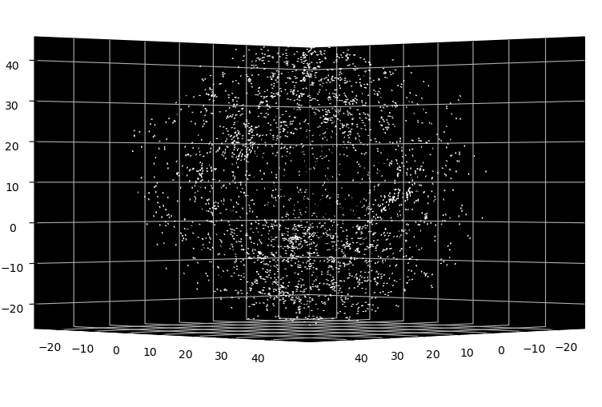

# vicsekpy

 

VICSEKpy is a 3-dimensional active matter simulation based on the vicsek model; traditionaly done in 2-dimensions
 
  
the x, y, z, positions are defined randomly within the simulation boundaries;
 
the x, y, z, velocities are defined initially in spherical coordinates:
 
 
$$x = v_{0}\sin(\theta)\cos(\phi),\qquad y = v_{0}\sin(\theta)\sin(\phi),\qquad z = -v_{0}\cos(\theta)$$
 
 
the active matter behavior is a result of the angle update rule:
 
 
$$\theta_{i}(t+1) = tan^{-1}\left[\frac{\sum_{j∈R}\sin(\theta_{j}(t)}{\sum_{j∈R}\cos(\theta_{j}(t)}\right]+\epsilon(t)$$
 
 
where the next angle is calculated from the sum of the previous angles with added noise, $\epsilon (t)$.

the simulation saves x, y, z, positions and velocities to be plotted later or assembled into an animation.
 
please go through the jupyter notebook for a tutorial on how to use!
 
enjoy  =^._.^=
